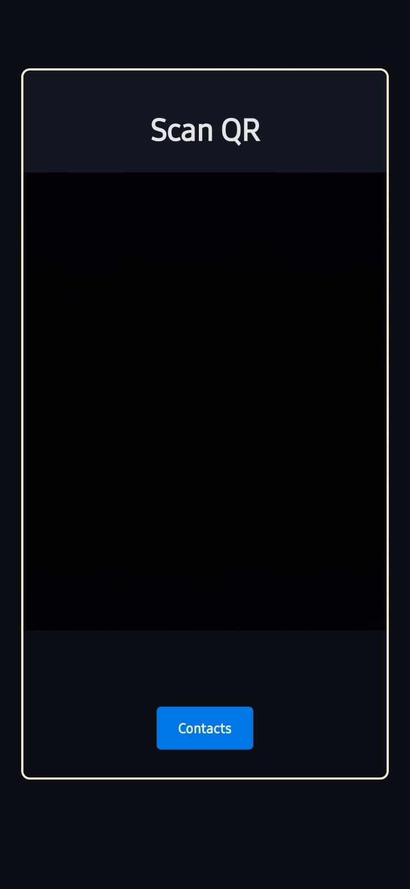
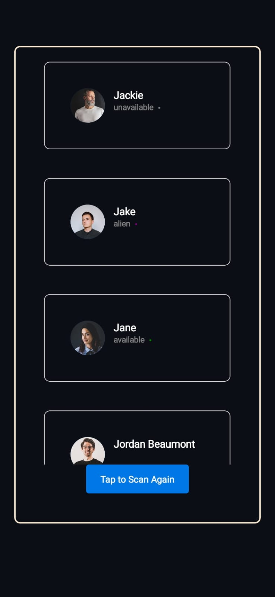

QR conference connector - Contact List (794)
For raw project instructions see: http://syllabus.africacode.net/react-native/qr-conference-connector/contact-list/

## Instructions

- _npm i_
- _npx expo start_
- Scan QR code in Expo Go App

---

## Extra Information

Please find the QR Codes inside the `qr_code_samples` folder.

> In order to create the QR use https://www.the-qrcode-generator.com/

### Template for QR Code

```
 name:
 position:
 email:
 profile pic:
 github:
 company name:
 site:
```

---

### Screenshots





